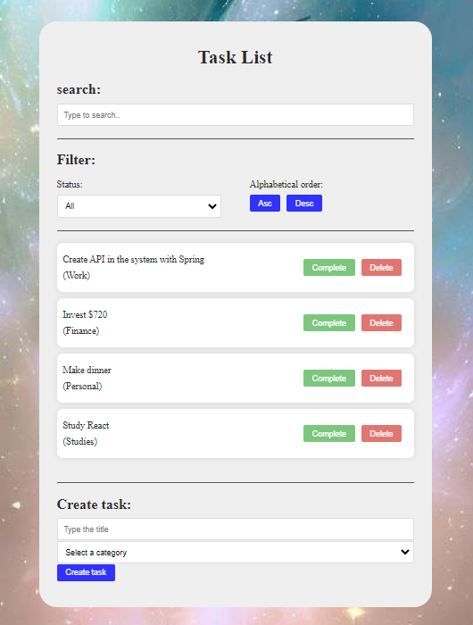
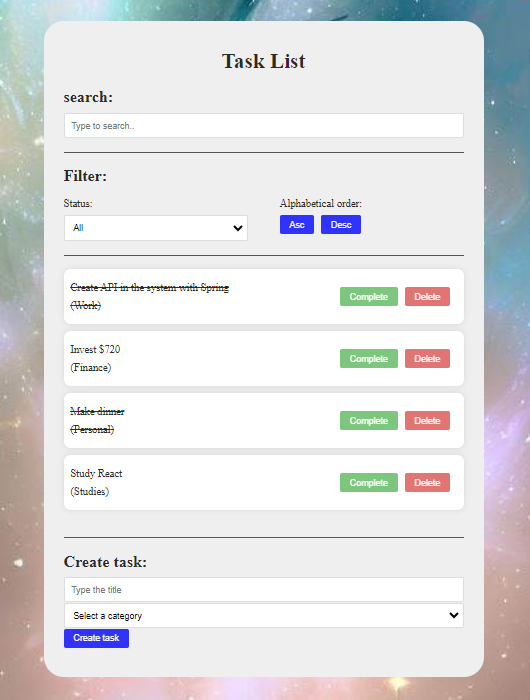
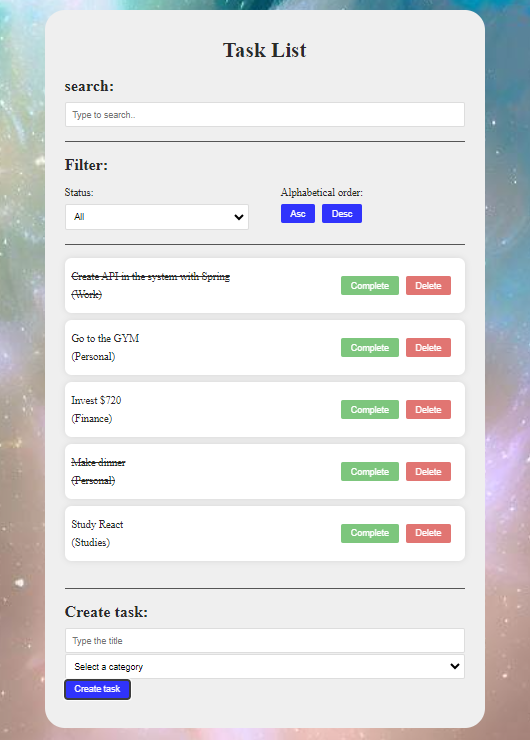
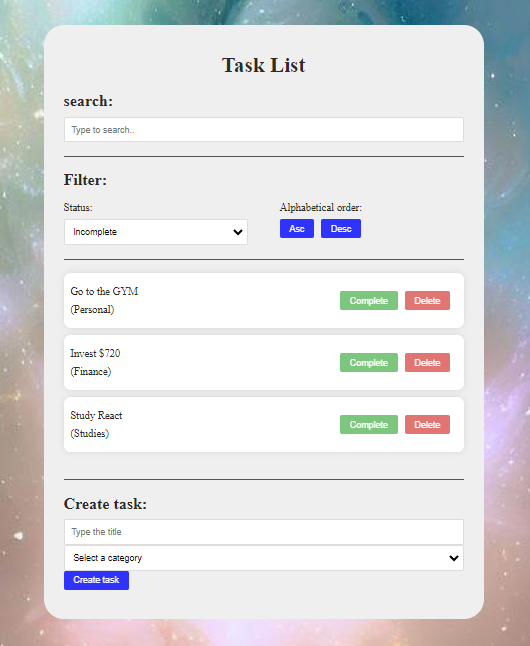

# Task-List📌✅

## About the project📜
Task List created to solidify front end knowledge, the project addresses a list of tasks that can be:
- added
- removed
- changed priority position
- searcheds

among other features

## Technologies used 💻⚙️ 
- Visual Studio Code
- React
- CSS3
- HTML5

## Example of features/project
### Home screen with some tasks

### Complete tasks

### Add new task

### Deleted tasks

